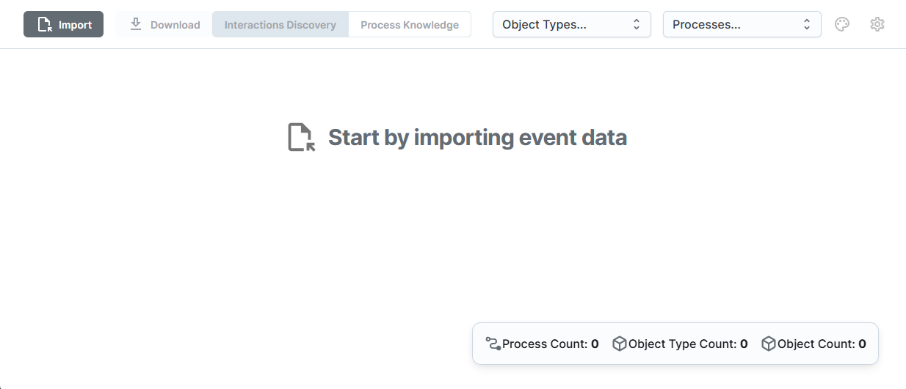
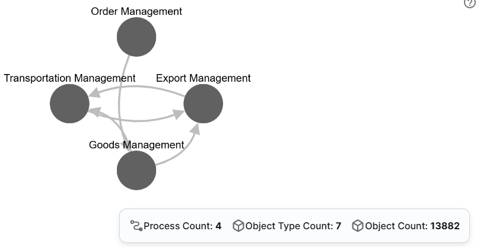
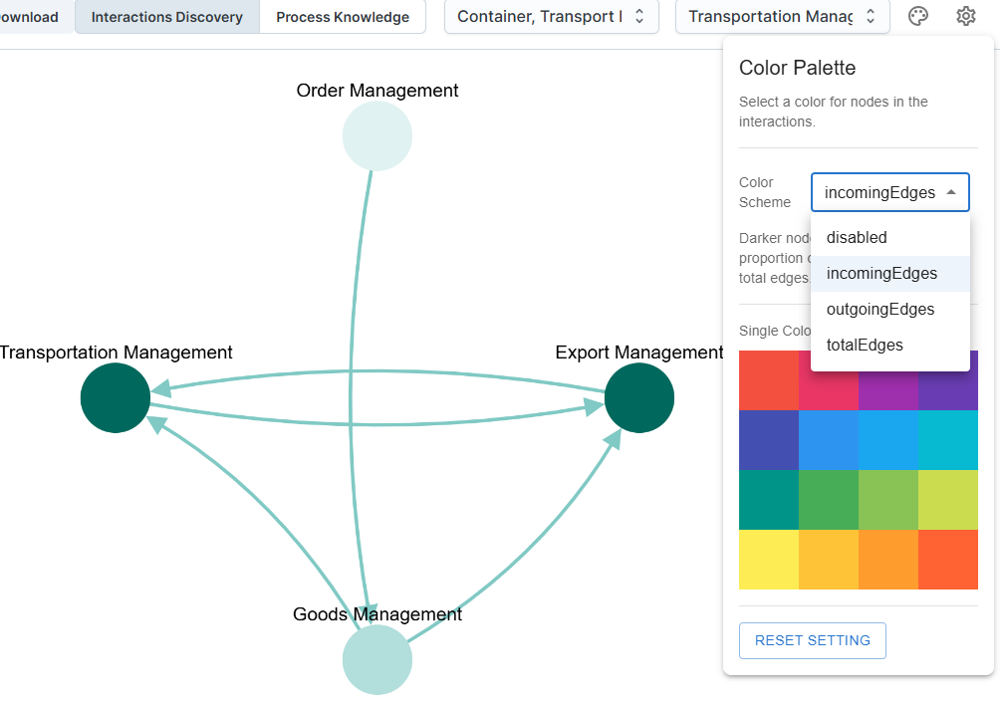
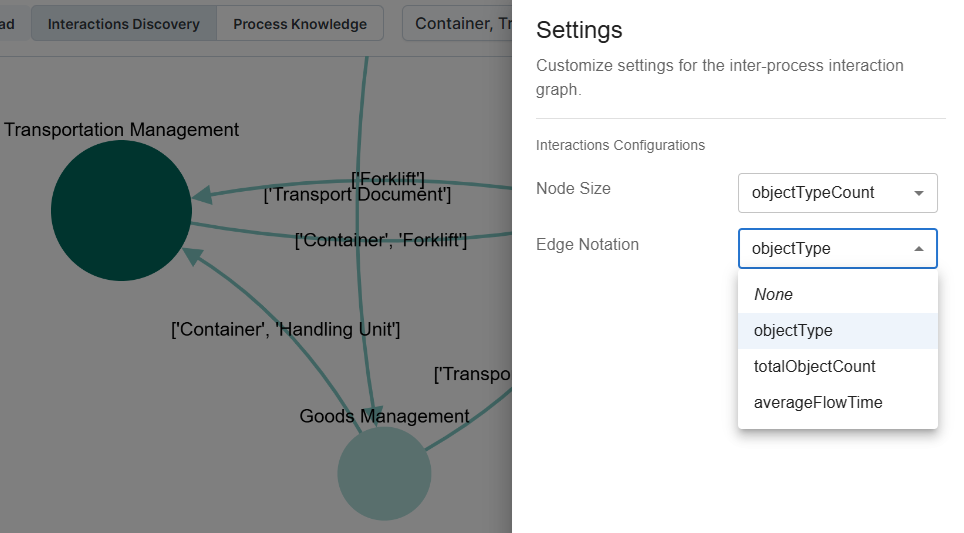
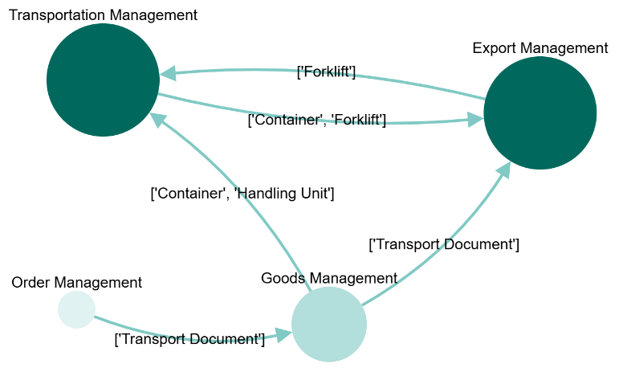
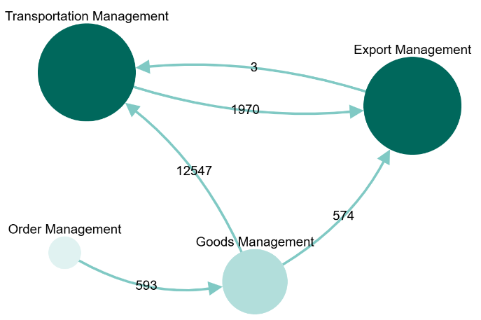
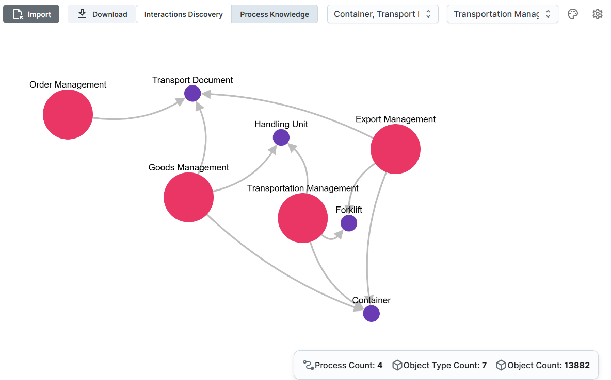
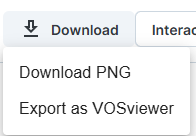

# 🔍 Discovering Interactions Among Processes

This walkthrough demonstrates how to systematically discover inter-process interactions from a process-enriched Object-Centric Event Log (OCEL) using the [Business Execution Graph](https://github.com/hudsonjychen/business-execution-graph) tool. The enriched OCEL exported in [Enriching OCEL with Process Scope Definition](./enriching-with-pocel.md) serves as the basis for the scenario described below.

---

## 1️⃣ Step 1: Import the POCEL Log

To begin, extract the exported log from the `outputs` folder. Launch the BEG Editor as described in the [Business Execution Graph documentation](https://github.com/hudsonjychen/business-execution-graph). The editor interface should appear as shown below:

Import the log using the **Import** button. By default, the tool visualizes the processes and their interactions: nodes represent processes, and edges represent interactions among them.

---

## 2️⃣ Step 2: Customizing the Interactions Discovery View

The tool enables customization of the process interaction visualization in several ways:

### ✏️ 2.1: Color

You can highlight the importance of process nodes using the color palette. Colors and their intensities can be set based on metrics such as `incomingEdges`, `outgoingEdges`, or `totalEdges`. An example is shown below:

### ✏️ 2.2: Interaction Labels

Interaction labels can be customized to display information such as object types, total object counts, or average flow time. Node size can also be set based on object type count or object count. The following image shows interactions among processes by object types:

### ✏️ 2.3: Arranging Nodes

Users can manually arrange nodes for improved visualization. The following figure demonstrates repositioning nodes for a clearer view:

Another example shows labels set to display total object counts:

As shown, three forklifts (as indicated in the previous page) move containers from the transport management to the export management process.

---

## 3️⃣ Step 3: Customizing the Process Knowledge View

The tool also provides a detailed process knowledge view, allowing users to further customize the visualization. An example graph using this view is shown below:

---

## ✅ Final Remarks

The tool supports exporting the graph as an image or to VOSViewer format, enabling advanced network analysis, as illustrated below:

