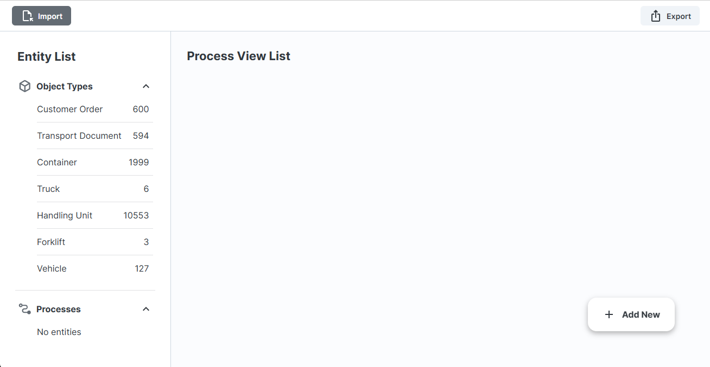
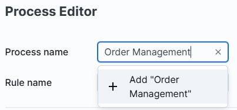
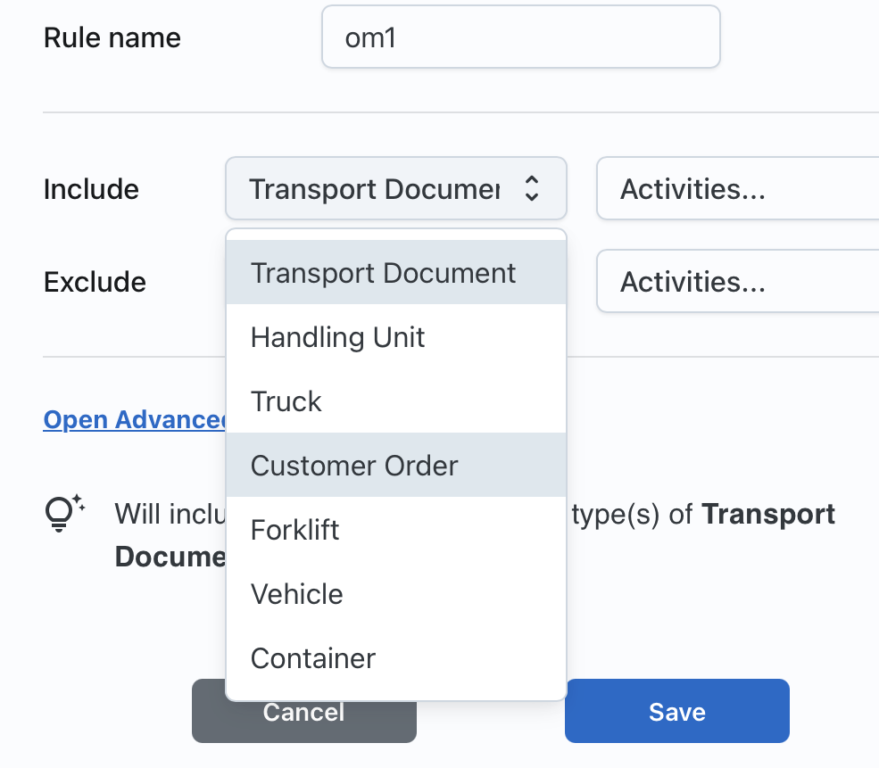
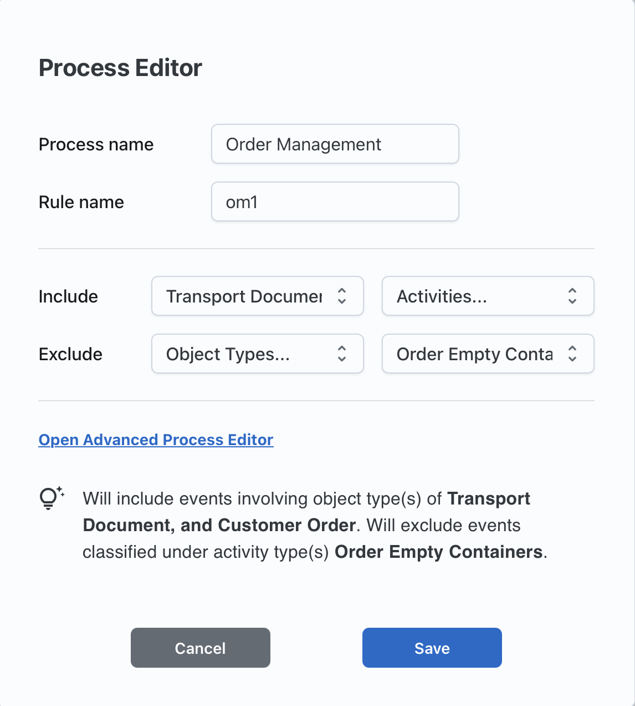
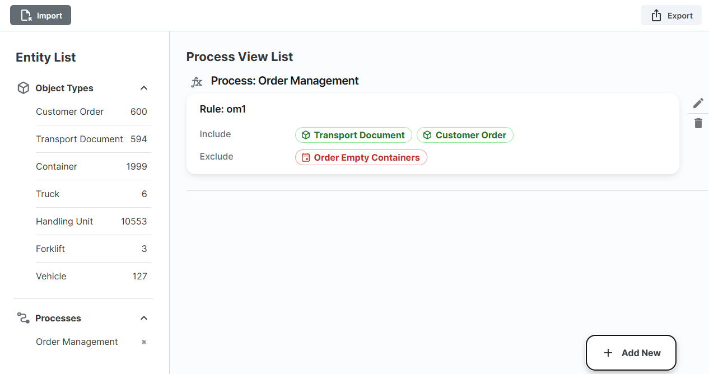
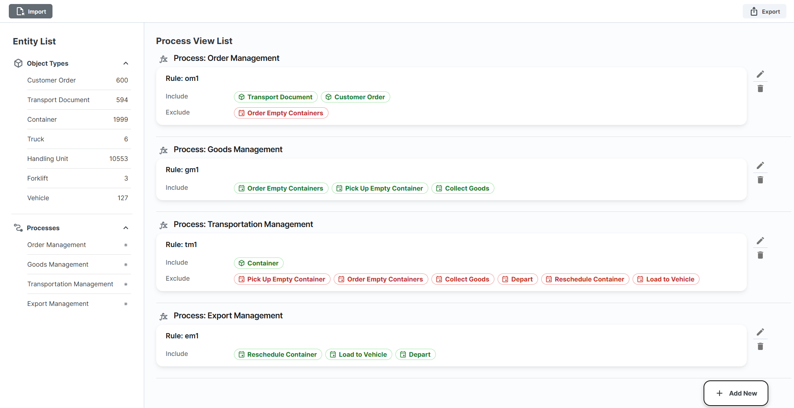

# ✍️ Enriching OCEL with Process Scope Definition

This walkthrough demonstrates how to enrich a raw Object-Centric Event Log (OCEL) using a visual rule editor. The process involves importing the original log, defining process-specific rules, and exporting an enriched version of the OCEL along with reusable rule definitions. Instructions for running the tool are provided at [POCEL Stellar](https://github.com/hudsonjychen/procellar). The following steps outline the enrichment process. Please note that process scope definition is subjective and should be based on domain knowledge. The rules defined here are for demonstration purposes only.

---

## 1️⃣ Step 1: Import the OCEL Log

Begin by importing the raw OCEL log, which can be downloaded from [OCEL Standard Logistics Log](https://ocel-standard.org/event-logs/simulations/logistics/), by clicking the **Import** button in the interface. Once the OCEL is successfully imported, the tool displays the list of object types on the left panel. As shown below, no processes are defined initially, so the process list appears empty. In the following steps, we demonstrate how to define rules to extract meaningful process views from this event log.

---

## 2️⃣ Step 2: Define Process Rules

For each process, define one or more **rules** to specify the process scope.

### ✏️ 2.1: Create Order Management Rule

To begin, we define a rule for the Order Management process. This process focuses on the creation and handling of customer orders and the preparation of related transport documentation, which initiates the broader logistics workflow.

- **Rule Name**: `om1`
- **Include**:
  - `Transport Document`
  - `Customer Order`
- **Exclude**:
  - `Order Empty Containers`

This rule filters the OCEL log to include only the events and objects essential to tracking customer orders and the generation of necessary documentation. It includes all events related to `Transport Document` or `Customer Order` object types, excluding the `Order Empty Containers` event. To define the rule, click the **Add New** button. The tool will open a **Process Editor** window in which you can define the rule. If no process is defined yet, enter the process name and the tool will prompt you to add a new process, as shown below:

You can include or exclude multiple object types or event types in the rule, as shown below:

If you include `Transport Document` and `Customer Order`, and exclude the `Order Empty Containers` event type, the tool will generate an explanation specifying what the rule means:

Press **Save** to define the rule, which will then be visualized in the main editor as shown below. Object types and event types are represented using different graphical icons. If you define a condition on attribute values, they are also shown visually in this editor. For multiple rules per process, the **fx** icon at the top of the rule allows you to specify whether the process should be evaluated using the `AND` or `OR` operator, as defined in the paper. As shown, the process list on the left panel is no longer empty and now displays the defined process.

### 📦 2.2: Create Goods Management Rule

Follow the same steps as above to define the Goods Management rule:

- **Rule Name**: `gm1`
- **Include**:
  - `Order Empty Containers`
  - `Pick Up Empty Container`
  - `Collect Goods`

### 🚚 2.3: Create Transportation Management Rule

Follow the same steps as above to define the Transportation Management rule:

- **Rule Name**: `tm1`
- **Include**:
  - `Container`
- **Exclude**:
  - `Pick Up Empty Container`
  - `Order Empty Containers`
  - `Collect Goods`
  - `Depart`
  - `Reschedule Container`
  - `Load to Vehicle`

### 🚢 2.4: Create Export Management Rule

You can follow the steps explained for creating Order Management Rule to define this rule as specified below. 

- **Rule Name**: `em1`
- **Include**:
  - `Reschedule Container`
  - `Load to Vehicle`
  - `Depart`

When you finish defining the rules described above, you shall see the rule editor as shown here: 

## 3️⃣ Step 3: Export the Enriched OCEL

Once all rules are defined and verified:

- Click the **Export** button.
- A `.zip` file is generated containing:
  - The **enriched OCEL** log (`procel.json`)
  - A **rules configuration file** (`definition-file.json`)

## ✅ Final Remarks

If the underlying log is updated (e.g., new events or objects added), you can **reuse the same rules**:
This enrichment workflow bridges the gap between raw OCEL data and process-centric analysis by enabling domain-aligned decomposition through intuitive rule definition and reuse.

